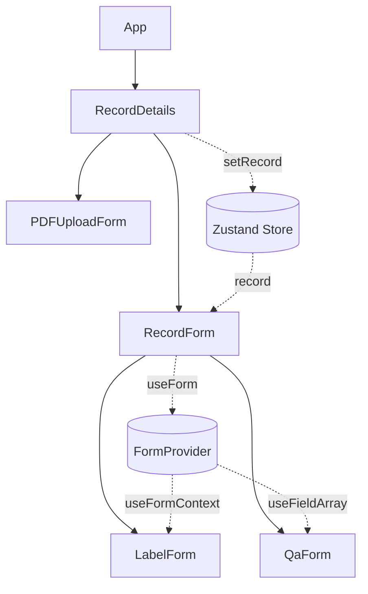
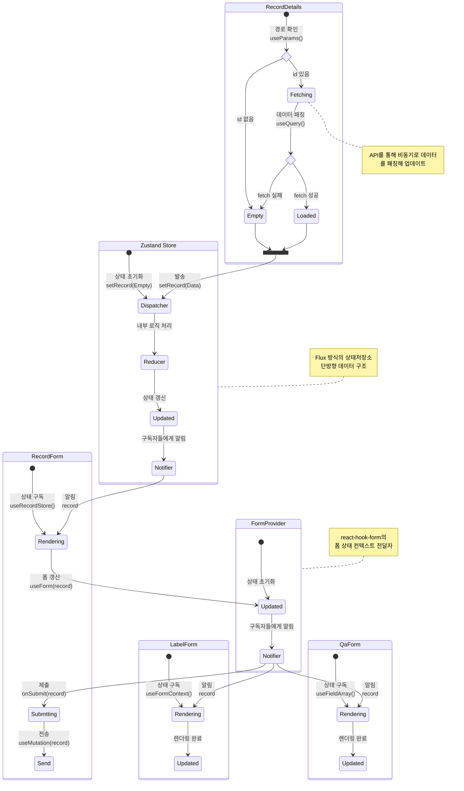

<div align="center">


# 기록 마이크로 프론트엔드

[](https://github.com/Daily1Hour/PickMe)

</div>

## 📜목차

-   [💻웹 페이지 소개](#기록-페이지-소개)
-   [✨주요 기능](#주요-기능)
-   [🎥데모](#데모)
-   [🛠기술 스택](#기술-스택)
-   [🧩컴포넌트 구성](#컴포넌트-구성)
-   [📁폴더 구조](#폴더-구조)
-   [실행 가이드](#기록-프론트엔드-실행-가이드)

<br/>

## 기록 페이지 소개

Pick-Me는 면접 예상 질문 답변을 작성해 면접에 대비하고 지난 면접을 스스로 분석 및 회고함으로써 취업 역량 강화를 장려하는 사이트 입니다.

기록 페이지에서는 자신이 쓴 이력서를 참고하면서 면접에 대한 예상 질문과 그에 따른 답변을 먼저 정리하면서 대비할 수 있습니다.

[🔗 기록 페이지 바로가기](https://daily1hour.github.io/PickMe-Record-Application/)  
[🔗 배포된 통합 웹 사이트 바로가기](https://main.dpdmc4drvy3w0.amplifyapp.com/)

> 새 창 열기 : CTRL+Click (Windows and Linux) / CMD+Click (MacOS)

<br/>

## ✨주요 기능

| 기능 | 내용 |
| --- | --- |
| 기록 | 지원할 회사, 면접 유형에 따라서 예상 질문 답변을 입력할 수 있는 폼 제공 |
| 이력서 미리보기 | 따로 창을 추가할 필요 없이 내가 쓴 이력서를 페이지 내에서 보면서 참고 할 수 있는 pdf 폼 제공 |

<br/>

## 🎥데모

https://github.com/user-attachments/assets/bcd9e317-a446-46d0-a993-dd176e6bb814

<br/>

## 🛠기술 스택

| 카테고리 | 스택 |
| --- | --- |
| 모듈 | [](https://single-spa.js.org/)[![Module Federation](https://img.shields.io/badge/Module_Federation-1C78C0.svg?logo=data:image/svg+xml;base64,PHN2ZyB4bWxucz0iaHR0cDovL3d3dy53My5vcmcvMjAwMC9zdmciIGZpbGw9Im5vbmUiIHZpZXdCb3g9IjAgMCAxNTkgMTUyIj4KICA8cGF0aCBzdHJva2U9IiMxMDhDQjkiIHN0cm9rZS1taXRlcmxpbWl0PSIxMCIgc3Ryb2tlLXdpZHRoPSIzLjIiIGQ9Ik05Ni4zIDEyLjcgNzkgMy4ybS0xNyA5LjYgMTctOS42bTE3LjMgMTM2LjFMNzkgMTQ4LjhtLTE3LTkuNiAxNy4xIDkuNk0zMi43IDI5LjYgMTYgMzkuOG0tLjMgMTkuNi4yLTE5LjZtLjEgMC0xMy44LThtMTQwLjQgNjAuOS0uMyAxOS42bS0xNi45IDEwLjEgMTYuOS0xMC4xbTAgMCAxMy43IDcuOU0xNS43IDkzbC40IDE5LjVNMzMgMTIyLjZsLTE3LTEwbTAtLjEtMTMuNiA4bTEyMi45LTkxLjEgMTYuOCAxMC4ybS4zIDE5LjYtLjMtMTkuNm0wIDAgMTMuNy04Ii8+CiAgPHBhdGggZmlsbD0iIzk1ODlFQyIgZD0iTTk2LjUgNDMuMyA3OSAzMy4zbC0xNy41IDEwTDc5IDUzLjRsMTcuNS0xMFoiLz4KICA8cGF0aCBmaWxsPSIjMUMyMTM1IiBkPSJNNzkgMzIuOCA2MS4yIDQzLjF2MjAuNkw3OSA3NC4xbDE4LTEwLjRWNDMuMUw3OSAzMi44Wm0xNi44IDEwLjVMNzkgNTNsLTE2LjctOS43TDc5IDMzLjdsMTYuOCA5LjZabS0zMy45LjcgMTYuNyA5LjZWNzNMNjIgNjMuM1Y0NFptMTcuNSAyOVY1My41TDk2LjEgNDR2MTkuM2wtMTYuNyA5LjZaIi8+CiAgPHBhdGggZmlsbD0iIzk1ODlFQyIgZD0iTTU5LjggMTA3LjRWODcuMkw0Mi40IDc3djIwLjJsMTcuNCAxMFoiLz4KICA8cGF0aCBmaWxsPSIjMUMyMTM1IiBkPSJNNTkuOCA2Ni42IDQyIDc2Ljl2MjAuNmwxNy44IDEwLjMgMTgtMTAuM1Y3Ni45bC0xOC0xMC4zWk03Ni42IDc3bC0xNi44IDkuNkw0My4xIDc3bDE2LjctOS43TDc2LjYgNzdabS0zMy45LjcgMTYuOCA5LjZ2MTkuM0w0Mi43IDk3Vjc3LjhabTE3LjUgMjguOVY4Ny40TDc3IDc3LjhWOTdsLTE2LjcgOS43WiIvPgogIDxwYXRoIGZpbGw9IiM5NTg5RUMiIGQ9Ik05OC4yIDEwNy40Vjg3LjJMMTE1LjcgNzd2MjAuMmwtMTcuNSAxMFoiLz4KICA8cGF0aCBmaWxsPSIjMUMyMTM1IiBkPSJNOTguMiA2Ni42IDgwLjMgNzYuOXYyMC42bDE4IDEwLjNMMTE2IDk3LjVWNzYuOUw5OC4yIDY2LjZaTTExNSA3N2wtMTYuNyA5LjZMODEuNiA3N2wxNi43LTkuN0wxMTUgNzdabS0zMy44LjcgMTYuNyA5LjZ2MTkuM0w4MS4yIDk3Vjc3LjhabTE3LjUgMjguOVY4Ny40bDE2LjctOS42Vjk3bC0xNi43IDkuNloiLz4KICA8cGF0aCBmaWxsPSIjOTU4OUVDIiBkPSJtMTE1LjcgNTQuOC0xNy41LTEwLTE3LjUgMTBMOTguMiA2NWwxNy41LTEwWiIvPgogIDxwYXRoIGZpbGw9IiM5NTg5RUMiIGQ9Ik05OC4yIDg1LjFWNjVsMTcuNS0xMHYyMEw5OC4yIDg1LjFaIi8+CiAgPHBhdGggZmlsbD0iIzFDMjEzNSIgZD0iTTk4LjIgNDQuMyA4MC4zIDU0LjZ2MjAuNmwxOCAxMC40TDExNiA3NS4yVjU0LjZMOTguMiA0NC4zWk0xMTUgNTQuOGwtMTYuNyA5LjctMTYuNy05LjcgMTYuNy05LjYgMTYuNyA5LjZabS0zMy44LjcgMTYuNyA5Ljd2MTkuM2wtMTYuNy05LjdWNTUuNVptMTcuNSAyOVY2NS4ybDE2LjctOS43djE5LjNsLTE2LjcgOS43WiIvPgogIDxwYXRoIGZpbGw9IiM5NTg5RUMiIGQ9Im03Ny4zIDU0LjgtMTcuNS0xMC0xNy40IDEwTDU5LjggNjVsMTcuNS0xMFpNNTkuOCA4NS4xVjY1TDQyLjQgNTV2MjBsMTcuNCAxMC4xWiIvPgogIDxwYXRoIGZpbGw9IiMxQzIxMzUiIGQ9Ik01OS44IDQ0LjMgNDIgNTQuNnYyMC42bDE3LjggMTAuNCAxOC0xMC40VjU0LjZsLTE4LTEwLjNabTE2LjggMTAuNS0xNi44IDkuNy0xNi43LTkuNyAxNi43LTkuNiAxNi44IDkuNlptLTMzLjkuNyAxNi44IDkuN3YxOS4zbC0xNi44LTkuN1Y1NS41Wm0xNy41IDI5VjY1LjJMNzcgNTUuNXYxOS4zbC0xNi43IDkuN1oiLz4KICA8cGF0aCBmaWxsPSIjOTU4OUVDIiBkPSJNNzkgMTE4LjVWOTguM2wtMTcuNS0xMHYyMC4xbDE3LjUgMTBabTAgMFY5OC4zbDE3LjUtMTB2MjAuMWwtMTcuNSAxMFoiLz4KICA8cGF0aCBmaWxsPSIjMUMyMTM1IiBkPSJNNzkgNzcuNyA2MS4yIDg4djIwLjZMNzkgMTE5bDE4LTEwLjRWODhMNzkgNzcuN1ptMTYuOCAxMC41TDc5IDk4bC0xNi43LTkuN0w3OSA3OC42bDE2LjggOS42Wm0tMzMuOS43IDE2LjcgOS42djE5LjNMNjIgMTA4LjJWODguOVptMTcuNSAyOVY5OC40TDk2LjEgODl2MTkuM2wtMTYuNyA5LjZaIi8+CiAgPHBhdGggZmlsbD0iIzcxQkVEQiIgZD0iTTEzNC41IDQzLjIgODAgMTEuNnYyMEwxMTcuMyA1M2wxNy4yLTEwWm0tOTMuNyAxMCAzNy41LTIxLjdWMTEuNkwyMy41IDQzLjJsMTcuMyAxMFptNzcuMiAxLjN2NDMuM2wxNy4zIDEwVjQ0LjRsLTE3LjMgMTBabS03Ny44LjEtMTcuMy0xMHY2M2wxNy4zLTEwdi00M1pNMjMuNyAxMDlsNTQuNiAzMS40di0yMEw0MSA5OWwtMTcuMyAxMFptNTYuMiAxMS41djIwbDU0LjUtMzEuNUwxMTcgOTlsLTM3IDIxLjVaIi8+CiAgPHBhdGggZmlsbD0iIzk1ODlFQyIgZD0iTTk2LjUgNjYuNCA3OSA1Ni4zbC0xNy41IDEwTDc5IDc2LjVsMTcuNS0xMFoiLz4KICA8cGF0aCBmaWxsPSIjOTU4OUVDIiBkPSJNNzkgOTYuNlY3Ni40bC0xNy41LTEwdjIwLjFMNzkgOTYuNlptMCAwVjc2LjRsMTcuNS0xMHYyMC4xTDc5IDk2LjZaIi8+CiAgPHBhdGggZmlsbD0iIzFDMjEzNSIgZD0iTTc5IDU1LjggNjEuMiA2Ni4xdjIwLjdMNzkgOTdsMTgtMTAuMlY2Nkw3OSA1NS44Wm0xNi44IDEwLjZMNzkgNzZsLTE2LjctOS42TDc5IDU2LjdsMTYuOCA5LjdabS0zMy45LjYgMTYuNyA5LjdWOTZMNjIgODYuM1Y2N1ptMTcuNSAyOVY3Ni43TDk2LjEgNjd2MTkuM0w3OS40IDk2WiIvPgo8L3N2Zz4K&style=flat-square&logoColor)](https://module-federation.io/) |
| 언어 | [](https://www.typescriptlang.org/)[](https://ejs.co/)[](https://ejs.co/) |
| SPA | [](https://reactjs.org) |
| SPA 라이브러리 | [](https://reactrouter.com/)[](https://tanstack.com/query/latest/docs/framework/react/overview)[](https://react-hook-form.com/)<br/> [](https://zustand-demo.pmnd.rs/) |
| 애플리케이션 라이브러리 | [](https://zod.dev/)[](https://axios-http.com/kr/docs/intro) |
| UI 라이브러리 | [](https://www.chakra-ui.com/) |
| 빌드 | [](https://ko.vite.dev) |
| 개발 도구 | [](https://www.postman.com/)[![Steiger](https://img.shields.io/badge/FSD_Steiger-211b1d.svg?logo=data:image/svg+xml;base64,PD94bWwgdmVyc2lvbj0iMS4wIiBlbmNvZGluZz0iVVRGLTgiPz4KPHN2ZyB2ZXJzaW9uPSIxLjEiIHhtbG5zPSJodHRwOi8vd3d3LnczLm9yZy8yMDAwL3N2ZyIgd2lkdGg9IjIwMCIgaGVpZ2h0PSIyMDAiPgo8cGF0aCBkPSJNMCAwIEMyOC4zOCAwIDU2Ljc2IDAgODYgMCBDODYgMy42MyA4NiA3LjI2IDg2IDExIEM1Ny42MiAxMSAyOS4yNCAxMSAwIDExIEMwIDcuMzcgMCAzLjc0IDAgMCBaICIgZmlsbD0iI0VCRUFFQSIgdHJhbnNmb3JtPSJ0cmFuc2xhdGUoNTcsMTAyKSIvPgo8cGF0aCBkPSJNMCAwIEMyOC4zOCAwIDU2Ljc2IDAgODYgMCBDODYgMy42MyA4NiA3LjI2IDg2IDExIEM1Ny42MiAxMSAyOS4yNCAxMSAwIDExIEMwIDcuMzcgMCAzLjc0IDAgMCBaICIgZmlsbD0iI0VCRUFFQSIgdHJhbnNmb3JtPSJ0cmFuc2xhdGUoNTcsODcpIi8+CjxwYXRoIGQ9Ik0wIDAgQzI4LjM4IDAgNTYuNzYgMCA4NiAwIEM4NiAzLjYzIDg2IDcuMjYgODYgMTEgQzU3LjYyIDExIDI5LjI0IDExIDAgMTEgQzAgNy4zNyAwIDMuNzQgMCAwIFogIiBmaWxsPSIjRUJFQUVBIiB0cmFuc2Zvcm09InRyYW5zbGF0ZSg1Nyw1NykiLz4KPHBhdGggZD0iTTAgMCBDMjguMzggMCA1Ni43NiAwIDg2IDAgQzg2IDMuNjMgODYgNy4yNiA4NiAxMSBDNTcuNjIgMTEgMjkuMjQgMTEgMCAxMSBDMCA3LjM3IDAgMy43NCAwIDAgWiAiIGZpbGw9IiNFQkVBRUEiIHRyYW5zZm9ybT0idHJhbnNsYXRlKDU3LDQyKSIvPgo8cGF0aCBkPSJNMCAwIEMxMy41MyAwIDI3LjA2IDAgNDEgMCBDNDEgMy42MyA0MSA3LjI2IDQxIDExIEMyNy40NyAxMSAxMy45NCAxMSAwIDExIEMwIDcuMzcgMCAzLjc0IDAgMCBaICIgZmlsbD0iI0U5RThFOCIgdHJhbnNmb3JtPSJ0cmFuc2xhdGUoNTcsMTQ3KSIvPgo8cGF0aCBkPSJNMCAwIEMxMy41MyAwIDI3LjA2IDAgNDEgMCBDNDEgMy42MyA0MSA3LjI2IDQxIDExIEMyNy40NyAxMSAxMy45NCAxMSAwIDExIEMwIDcuMzcgMCAzLjc0IDAgMCBaICIgZmlsbD0iI0U5RThFOCIgdHJhbnNmb3JtPSJ0cmFuc2xhdGUoNTcsMTMyKSIvPgo8cGF0aCBkPSJNMCAwIEMxMy41MyAwIDI3LjA2IDAgNDEgMCBDNDEgMy42MyA0MSA3LjI2IDQxIDExIEMyNy40NyAxMSAxMy45NCAxMSAwIDExIEMwIDcuMzcgMCAzLjc0IDAgMCBaICIgZmlsbD0iI0U5RThFOCIgdHJhbnNmb3JtPSJ0cmFuc2xhdGUoNTcsMTE3KSIvPgo8cGF0aCBkPSJNMCAwIEMxMy41MyAwIDI3LjA2IDAgNDEgMCBDNDEgMy42MyA0MSA3LjI2IDQxIDExIEMyNy40NyAxMSAxMy45NCAxMSAwIDExIEMwIDcuMzcgMCAzLjc0IDAgMCBaICIgZmlsbD0iI0U5RThFOCIgdHJhbnNmb3JtPSJ0cmFuc2xhdGUoNTcsNzIpIi8+Cjwvc3ZnPgo=&style=flat-square&logoColor=black)](https://github.com/feature-sliced/steiger)[](https://eslint.org/)[](https://prettier.io/) |
| 문서 | [](https://storybook.js.org)[](https://www.figma.com/) |

<br/>

### 컴포넌트 의존성 그래프



### 상태 전이 다이어그램



## 🧩컴포넌트 구성

### 📝Figma


<br/>

### 📄구현된 페이지


<br/>

## 📁폴더 구조

```python
pickme
├─ .env # 환경변수
├─ .env.sample
├─ .env.single-spa
├─ .prettierrc # 포맷터
├─ eslint.config.js
├─ index.html
├─ src
│  ├─ app
│  │  ├─ App.tsx
│  │  ├─ application.tsx # single-spa 진입점
│  │  ├─ main.tsx
│  │  ├─ parcel.tsx
│  │  └─ router.tsx # 라우터
│  ├─ entities # 프로젝트 엔터티
│  │  └─ records
│  │     └─ model
│  │        ├─ Detail.ts
│  │        ├─ index.ts
│  │        ├─ Record.ts # 인터페이스
│  │        └─ Summary.ts
│  ├─ features # 기능 구현
│  │  ├─ records
│  │  │  ├─ api
│  │  │  │  ├─ detailsApi.ts # 데이터 조회, 생성, 삭제
│  │  │  │  └─ recordsDTOList.ts # 데이터 전송 객체
│  │  │  ├─ hook
│  │  │  │  ├─ useQaMutation.ts # Qa폼에서 사용할 데이터 관리, 처리
│  │  │  │  └─ useRecordMutation.ts # Record폼에서 사용할 데이터 관리, 처리
│  │  │  ├─ index.tsx
│  │  │  ├─ model # 폼 스키마
│  │  │  │  └─ RecordSchema.ts
│  │  │  ├─ service # 레코드 관련 엔터티<->dto 변환 메소드
│  │  │  │  ├─ detailToDto.ts
│  │  │  │  ├─ dtoToRecord.ts
│  │  │  │  ├─ index.ts
│  │  │  │  ├─ recordToDto.test.ts
│  │  │  │  └─ recordToDto.ts
│  │  │  ├─ store # 중앙 상태 저장소
│  │  │  │  └─ recodStore.ts
│  │  │  └─ ui
│  │  │     ├─ AddDetail.tsx # 세부정보(질문/답변) 필드 추가 버튼
│  │  │     ├─ DeleteConfirm.tsx # 삭제 확인 경고성 다이얼로그
│  │  │     ├─ DeleteDetail.tsx # 세부정보 삭제 버튼
│  │  │     ├─ EditableControl.tsx
│  │  │     ├─ EditableField.tsx
│  │  │     ├─ index.ts
│  │  │     ├─ LabelForm.tsx # 라벨(회사명/면접유형) 폼
│  │  │     ├─ PDFUploadForm.tsx # pdf 미리보기 폼
│  │  │     ├─ QaField.tsx # 질문/답변 필드
│  │  │     ├─ QaForm.tsx # 질문/답변 관리 컴포넌트
│  │  │     └─ RecordForm.tsx # 레코드 전체 관리 컴포넌트
│  │  └─ side
│  │     ├─ api
│  │     │  └─ sideApi.ts # 사이드바 데이터 가져오기
│  │     ├─ hook
│  │     │  └─ usePagination.ts # 페이지네이션
│  │     ├─ index.tsx # 사이드바 컴포넌트
│  │     └─ service # 사이드바 엔터티<->dto 변환 메소드
│  │        ├─ dtoToSide.ts
│  │        └─ index.ts
│  ├─ pages # 페이지
│  │  └─ records
│  │     └─ index.tsx
│  └─ shared # 공유
│     ├─ api
│     │  ├─ client.ts # Axios 인스턴스
│     │  ├─ index.ts
│     │  ├─ router.ts # 의존성 역전(DIP), 의존성 주입
│     │  └─ tokens.ts # 토큰 3종 호출 및 추출
│     └─ chakra-ui
│        ├─ color-mode.tsx
│        ├─ Field.tsx
│        ├─ input-group.tsx
│        ├─ provider.tsx
│        └─ toaster.tsx
├─ steiger.config.ts # FSD 린트
├─ styleguide-types.d.ts
├─ tsconfig.app.json
├─ tsconfig.json
├─ tsconfig.node.json
├─ typedoc.json
├─ vite-env.d.ts # 환경변수 타입 정의
└─ vite.config.ts # Vite 설정

```

## 📖기록 프론트엔드 실행 가이드

[🔗 기록 서비스 백엔드 깃허브 바로가기](https://github.com/Daily1Hour/PickMe-Records-Service)

```sh
$ npm install
$ npm run dev
```
